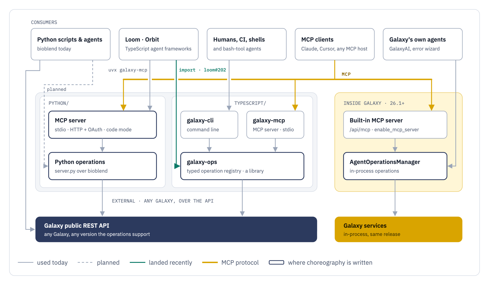
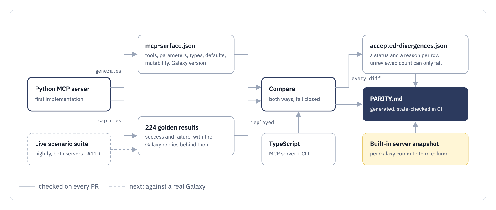

# Galaxy MCP roadmap

This repo holds two implementations of one agent-facing surface for Galaxy: a Python MCP server
(`python/`, on PyPI as `galaxy-mcp`) and a TypeScript workspace
(`typescript/`, on npm as `@galaxyproject/galaxy-ops`, `galaxy-cli` and `galaxy-mcp`).
Galaxy itself ships a third, built-in MCP server. This page explains why each exists, how they
relate, where things stand, and what the work ahead is. `contract/` holds what both
implementations are checked against, and `PARITY.md` is the generated, CI-checked record of where
they disagree.

## Where things stand (October 2026)

| | Version | Status |
| --- | --- | --- |
| Python MCP server | `galaxy-mcp` 1.11.1 on PyPI | 46 tools; stdio and HTTP with OAuth; hardened HTTP transports (1.11.0, 1.11.1) |
| TypeScript workspace | `@galaxyproject/*` 0.3.1 on npm | 45 tools (all but `connect`); MCP server, CLI and library from one registry |
| Galaxy built-in server | Galaxy 26.1+ | 44 tools at `/api/mcp`, behind `enable_mcp_server` |

- **Python and TypeScript agree.** Two recorded differences, both intentional. Every open tool
  is replayed through both surfaces against 224 golden results the Python server produced,
  65 of them failures, and compared key for key.
- **The built-in server is measured, not reconciled.** 54 differences are recorded in the third
  column of `PARITY.md` and held at that count. Reconciling them is a conversation with Galaxy.
- **The first TypeScript consumer is live.** Loom reads workflow invocations through
  `@galaxyproject/galaxy-ops` (galaxyproject/loom#202). It still launches the Python server for
  everything else.

## How the pieces fit

Solid arrows are how things are used today; dotted arrows are planned. The Python operations,
galaxy-ops and Galaxy's AgentOperationsManager are the three places Galaxy choreography is
written; everything else is a consumer or a projection.

<picture>
  <source media="(prefers-color-scheme: dark)" srcset="docs/roadmap/architecture-dark.png">
  
</picture>

## Why an operations layer, and why MCP

The obvious alternative is to hand an agent Galaxy's OpenAPI spec and let it call the API. That
works for a demo and fails in use, for reasons that have nothing to do with MCP:

- **Galaxy's API is large and choreographed.** The useful things are multi-step: upload, poll,
  run, poll. Tool inputs are flattened `cond|param` keys on the legacy path and nested on the
  26.0+ tool-request path. Workflow inputs are keyed by step index, label or uuid. A dataset
  reference has three sources and a collection is a fourth. An agent given the raw spec works
  this out per session, spends the tokens, and gets it wrong in ways that cost real jobs. The
  operations layer works it out once.
- **Failures have to be readable.** Galaxy answers a bad tool run with a 400 and a dump of the
  tool schema, and on some paths an HTML error page (#101). The layer turns that into which
  parameter, what it expected, what it got and what to change, and since #123 the Python server
  refuses mismatches it can prove before anything is submitted.
- **Output has to be bounded.** A history's contents or a tool panel on a production server does
  not fit in a context window. Every list tool pages, caps the page, and trims to a byte budget
  (#116, #127), and says so when it did.
- **Credentials stay out of the model.** The server holds the API key, or an OAuth session per
  user on the HTTP transport. The model never sees or emits it. Raw API calls put the key in the
  transcript.
- **A fixed surface can be measured.** A named set of operations gets a generated manifest,
  version requirements, a parity report, golden results and an eval harness for tool selection.
  "The whole API" cannot be held to parity with anything or measured against anything.
- **Any MCP client works without integration code.** Claude Desktop, Cursor, Loom, and Galaxy's
  own in-process agents through the built-in server. The alternative is an adapter per client, or
  a skill full of curl.

MCP is the delivery mechanism with the broadest client support, not the whole idea. Loading every
tool schema on every turn has a real cost (about 30k tokens, #124), and small-context models never
see most of the list. "Stop using MCP" in practice means "stop loading schemas every turn", and
there are two ways to do that, which get called "code mode" interchangeably and are not the same
thing:

- **Progressive discovery.** The catalog collapses to `search`, `get_schemas` and one `run` tool
  (`GALAXY_MCP_DISCOVERY_MODE=code` on the Python server). The model still calls tools by name;
  it just stops paying for the whole list. This is a feature of a server, and any server built on
  the same framework can adopt it, including Galaxy's built-in one.
- **Calling Galaxy as code.** The agent writes a script that imports operations and runs it in
  its own sandbox; a command line is the shell form of the same thing. No hosted server can
  provide this, because it needs a library in the agent's process, in the agent's language. This
  is the reason an operations *library* has to exist alongside the servers.

The long tail of Galaxy is not walled off either: `run_tool`, `invoke_workflow` and user-defined
tools reach everything Galaxy can do, and nothing stops an agent calling the API directly for the
rare case.

The surface is deliberately a thin orchestration layer, not a mirror of the API. A new tool has to
earn its slot as a primitive; depth comes from running tools and workflows, not from more tools.
The bottleneck we keep finding is guidance and call volume, not tool count.

## Why there are two MCP servers

Galaxy has a **built-in** MCP server (`lib/galaxy/webapps/galaxy/api/mcp.py`, `enable_mcp_server`
in `galaxy.yml`, served at `/api/mcp`, Galaxy 26.1 and later). This repo's servers are
**external**: separate processes that talk to Galaxy over its public API.

They are parallel, not a pipeline, and each earns its place:

| | Built-in (in Galaxy) | External (this repo) |
| --- | --- | --- |
| Runs | inside the Galaxy process, in-process service calls | anywhere, over the public API |
| Galaxy versions | exactly the one it ships in | any version it can talk to, checked per operation |
| Enabled by | the Galaxy admin, per deployment | the user, with a URL and key |
| Release cadence | Galaxy's, a few times a year | its own |
| Also serves | Galaxy's own agents (GalaxyAI, the error wizard) | MCP clients, scripts, CI, TypeScript programs |
| Galaxies per session | the one it runs in | as many as the user connects |

The built-in server is the right answer when the deployment enables it and the agent runs against
that one Galaxy. The external servers are the right answer for everything else: usegalaxy.*
servers that have not enabled it, older Galaxies, local development against `main`, and any
client that needs OAuth or a container. Which side an operation lands on is decided by what it
needs: in-process internals, or just the API.

The cost of two is drift, and the answer is to make the contract explicit and checked rather than
to pick one. Since #135 the built-in server is the third column in `PARITY.md`, generated from a
Galaxy checkout and stamped with the Galaxy commit it reflects. It currently records 54
differences on the tools both sides have, mostly names, defaults and the per-call `api_key`.

The built-in server should end up on by default, the way the API is, once its transport holds
the credential in a session rather than taking `api_key` on every call and has the usual HTTP
hardening. That would remove the admin gate but not the rest: older Galaxies, fixes that arrive
at release cadence, stdio clients, and one agent talking to several Galaxies. The last of those
is structural: a server bound to one Galaxy cannot hold connections to others, and it should not
hold their credentials, while an external server can keep a table of them and let the agent pick
per step. One plausible end state is the external server as the front door everywhere, holding
that table, proxying to `/api/mcp` where a Galaxy has it and using the API where it does not.
That is a direction, not a plan.

## What galaxy-ops is

`@galaxyproject/galaxy-ops` is the framework-free core of the TypeScript side: a typed Galaxy
client over the official `@galaxyproject/galaxy-api-client` types, an operation registry, a typed
error model, and the run/poll orchestration for tool runs and workflow invocations. It depends on
no CLI or MCP framework, and it has a browser entry that registers only what runs there (#138).

The surfaces are projections of that registry and contain no Galaxy logic of their own:

- `@galaxyproject/galaxy-mcp` registers every operation as an MCP tool over stdio, taking the same
  snake_case parameter names as the Python server (#137).
- `@galaxyproject/galaxy-cli` registers every operation as a subcommand, with table and JSON
  output and exit codes that mean something.
- A TypeScript program imports the operations directly: `(input, ctx) => Promise<data>`, typed
  data or a typed error. This is "calling Galaxy as code", and the reason the workspace exists.

A new operation shows up in all three with no surface-specific code, and dependency direction is
enforced: a surface cannot reach the raw client.

That reason is a bet, and it should be read as one. Its test is Loom adopting galaxy-ops and
dropping the Python runtime it bundles today to spawn `uvx galaxy-mcp`. The first step has
landed: Loom's invocation reads go through `getInvocations` and its `InvocationDetail` type, which
comes from Galaxy's OpenAPI schema (galaxyproject/loom#202). The advantage galaxy-ops has to show
over bioblend is not "a client in TypeScript" but the choreography: input templates, version
checks, polling, bounded results, typed errors. The date for the rest is in the roadmap; if it
passes without the adoption, the TypeScript MCP server is marked experimental here and the parity
posture changes to "TypeScript may lag".

There is also a Python command line, `gxy` (#56), written before galaxy-ops existed as thin
wrappers over the Python server's tool functions. It is not built on an operations layer, so it
would have to be kept in step by hand, and it has not been merged. The command line this repo
leans on is `@galaxyproject/galaxy-cli`, because it is a projection of the same registry as the
MCP server: a fix or a new operation reaches both, and the parity check covers it.

## Why Python and TypeScript

Counting MCP servers gives the wrong number. What costs effort is the number of places the Galaxy
choreography is written down, and there are three: the in-process operations in Galaxy, the
Python operations in `python/`, and the TypeScript operations in galaxy-ops. The
first two are separated by the boundary above and cannot be merged. The question is the third.

The Python server came first and is what is deployed: it is what Galaxy's own documentation
points at, what the skills and evals are written against, and what the agent frameworks launch
today. It carries the discovery stack (tool tags, a visibility middleware, the code-mode transform,
a server instructions block), the HTTP transport with OAuth, the container image, and the
preflight and bounding work above.

The TypeScript workspace exists because the agent frameworks that consume this surface are
TypeScript, and a framework wants a typed library it can import and bundle, not a Python
subprocess it has to ship and spawn. That cutover is most of the reason the parity work exists:
Loom ran entirely against the Python server, and moving it onto the TypeScript implementation must
not change what it gets back. So the shared contract was captured from what the Python server
actually answers. That is a statement about what deployed clients already depend on, not about
which implementation got it right: the Python server was a first pass, and where the two disagreed,
TypeScript took the Python behaviour to keep Loom's cutover invisible -- including `run_tool`,
which had adopted Galaxy's newer tool-request path first and now submits and returns the way the
Python one does. A few places were fixed on the Python side instead (#132).

The golden results pin a contract, then, not a preference. Some of what they pin is accidental --
failure sentences that quote the HTTP library's error text verbatim, a Python bytes repr included
-- and the contract is meant to improve. What changed is how: with both implementations checked
against the same fixtures, an improvement is one change that lands on both sides at once and
updates the fixtures with it, the way #155 does for history contents and pages.

Two implementations of one contract also find bugs a single one hides. The parity work turned up
a TypeScript template its own `run_tool` rejected, defaults and caps that disagreed, five tools
diagnosing a 404 from the error's text (#133), and an invocation read that dropped
`step_details` on both sides at once (#152).

The same argument cuts the other way. If calling Galaxy as code matters, a Python agent deserves
the same library a TypeScript agent gets, and it does not have one: the Python server's operations
are only importable with the MCP framework attached. Factoring them into a framework-free package
is planned (the first piece is parked as #139), and where that package should live -- in this
repo, or in bioblend, which is what Python agents already reach for -- is open.

No code is shared between them and none can be. What they share is Galaxy's OpenAPI schema, a
set of opinions about how to use it, and a contract enforced in CI:

<picture>
  <source media="(prefers-color-scheme: dark)" srcset="docs/roadmap/parity-contract-dark.png">
  
</picture>

What that enforces today: which tools exist, their parameters, types, requiredness, declared
defaults, whether a tool says it mutates, and the Galaxy version it needs; and, for every open
tool, that both implementations answer a recorded Galaxy reply with the same envelope -- the same
data, the same message, the same failure sentence, and on the CLI the exact exit code. What it does not cover yet is a live Galaxy: the replies are recorded, so a change
in Galaxy itself shows up only when they are re-captured. That is #119.

Neither implementation is deprecated and neither is primary. An earlier plan said the Python
server would enter maintenance once TypeScript reached parity; that claim rested on a list of
tool names, and the parity work since showed how much a name list hides. Whether one of them
should ever become primary is a question for after the live suite exists and Loom has cut over.

## Principles

- **Thin orchestration surface, not an API mirror.** Depth comes from `run_tool`,
  `invoke_workflow` and user-defined tools. A tool earns its slot as a primitive.
- **Galaxy is the source of truth on validation.** Client-side checks refuse only what they can
  prove Galaxy would refuse, and say when they could not check. A false rejection is worse than
  the error it replaces.
- **Bounded output, always.** Every list pages, caps and budgets, and reports what it dropped.
- **Measure before changing the default.** Whether the default catalog should be flat or gated,
  and what the tool list should carry, is decided by tool-selection evals, not by token counts or
  argument (#124).
- **Parity is a checked artifact, not a promise.** Differences are allowed; unrecorded
  differences are not.
- **The contract moves, in sync.** Nothing about today's behaviour is frozen. Any part of it can
  change, as long as both implementations and the fixtures change in the same pull request.
- **Version compatibility lives in the layer.** Operations declare the Galaxy they need and are
  refused before any request goes out on a server that is too old.

## Roadmap

### Done since September

- Generated surface manifest and a fail-closed comparator (#110), `PARITY.md` and the ratchet (#122).
- Galaxy version requirements on both sides (#114, #115); bounded list output (#116, #127).
- `run_tool` input preflight on the Python server (#123).
- Ports to galaxy-ops: Pages (#112), `recommend_biocontainer` (#136), dataset rows (#134).
- snake_case on the TypeScript MCP wire; packages cut at 0.2.0 (#137).
- Galaxy's built-in server as the third parity column (#135).
- Result parity: the envelope (#140), what is inside it (#142), a golden case for every open tool
  (#143), messages (#144) and failures (#145).
- Releases: galaxy-mcp 1.11.0 with hardened HTTP transports, and 1.11.1, which limits `connect`
  over HTTP to the Galaxies the operator allows (#158, building on #156); TypeScript 0.3.0 and
  0.3.1 published through staged, maintainer-approved npm releases with provenance (#151).
- Repository layout: `python/`, `typescript/`, and a shared `contract/` that neither
  implementation owns (#159).
- Loom reads invocations through galaxy-ops (galaxyproject/loom#202).

### In review

- #153 -- `invoke_workflow` can run a specific stored version of a workflow.
- #155 -- aligns the two surfaces further: one set of tool descriptions, history contents fetched
  as a filtered, sorted window, section-level page edits with a content hash, and job outcomes on
  a single invocation.

### Next: behaviour against a real Galaxy

1. **#119 -- live scenario suite** over MCP stdio against both servers, nightly, failing loudly
   when it cannot reach a Galaxy rather than skipping. It re-captures the golden replies and
   refreshes the built-in snapshot, so recorded parity cannot quietly go stale.
2. **Make the ratchet mechanically one-way** (compare against the merge base) instead of
   reviewer-enforced.
3. **More golden cases where coverage is thin**, starting with `get_tool_input_template` (3
   cases). The envelope replay already does what #118 proposed one level up: every tool that uses
   a ported helper (templates, workflow-input normalisation, search ranking, paging) is replayed
   through both surfaces.

### Convergence with Galaxy's built-in server

The 54 differences in the third column are written up as a reconcile list for galaxyproject/galaxy:
two tools under different names (`list_histories`/`get_histories`,
`search_tools`/`search_tools_by_name`), four tools only the built-in server has
(`get_job_status`, `get_invocation_details`, and two file-source listings), defaults and caps that
differ, the per-call `api_key`, and missing read-only hints. Each one is a rename, an addition or a
removal that has to be agreed with Galaxy, so they are counted and ratcheted apart from the
Python-TypeScript registry.

Tool inputs are the deeper convergence. Today both external servers submit tools on the legacy
path, and the Python server's preflight walks the legacy input tree by hand. The destination is
Galaxy's own parameter models on both sides (`galaxy.tool_util.parameters` and
`@galaxy-tool-util/schema`, read from `/api/tools/{id}/inputs`, Galaxy 26.0+), which would replace
the hand-rolled checker rather than port it to TypeScript.

### TypeScript consumers

- **Loom on galaxy-ops.** Invocation reads are done (galaxyproject/loom#202). Next are the rest of
  the reads, then tool runs and workflow invocations, then dropping the `uvx galaxy-mcp`
  subprocess and the Python runtime from Loom's bundle. This is the milestone that justifies the
  TypeScript workspace. Target: end of 2026. If it has not happened by then, the TypeScript MCP
  server is documented as experimental until it does.

### Getting more out of each call

- **Invocation reporting**: one call that says where an invocation is and what failed, instead of
  a walk through steps and jobs. #152 and #155 move `get_invocations` most of the way.
- **Mapping a tool over a collection** (#154): the input template and `run_tool` do not show the
  batch envelope an agent needs for this.
- **Tool-list diet** (#124): the `tools/list` payload is about 30k tokens, most of it a response
  schema repeated per tool. Shrink it one change at a time, each gated on a tool-selection eval
  with a frontier model and a local model at a realistic context size.
- **Exposure default**: the gating substrate (tags, middleware, code mode) exists and is off by
  default. Whether the default should be the curated core with a discovery path, or the flat
  catalog, is decided by the same evals.

### Python as a library

- **Framework-free Python operations.** The operations in `python/` become
  importable without the MCP framework, so a Python agent can call Galaxy as code the way a
  TypeScript one can, and the server and any CLI become adapters over them. Whether that package
  lives here or in bioblend is undecided; bioblend is what Python agents script with today, which
  is an argument for it, and a question for its maintainers.

### Several Galaxies at once

Today a session holds one connection. Two Galaxies means two server entries in the client, which
works, doubles the tool list, and lets nothing reason across them. The built-in server cannot do
this at all, so it is work only the external side can do.

- **Named connections.** `connect` more than once with an alias; every tool takes an optional
  `server` that defaults to the current one; a tool to list connections. One copy of the tool
  list, N Galaxies.
- **Fan-out reads.** Which connected Galaxy has this tool, this reference genome, quota to
  spare, a history by this name: the read tools accept "all" and tag each result with its server.
  This is what lets an agent choose a Galaxy per step, the way it chooses between Galaxy and
  local today.
- **Moving data between Galaxies** only through Galaxy's own mechanisms -- history export and
  import, fetch by URL -- so bytes never pass through the MCP process or the model.
- **Out of scope:** one login for many Galaxies. That is an identity question for Galaxy, not
  for this layer; each connection carries its own credential.

### Not planned

- A 1:1 mirror of the Galaxy API as tools.
- Sharing code between the Python and TypeScript implementations.
- Client-side validation that blocks what Galaxy would accept.
